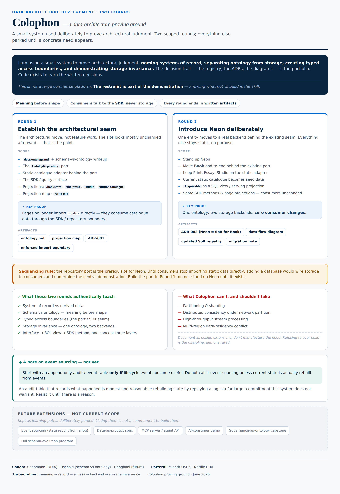

# Colophon data architecture proving ground

Colophon is a deliberately small system used to prove architectural judgement:
naming systems of record, separating ontology from storage, creating typed access
boundaries, and demonstrating storage invariance. The decision trail—the
ontology, ADRs, projection map, and diagrams—is the portfolio. Code exists to
earn the written decisions.

This is not a large commerce platform. Restraint is part of the demonstration:
knowing what not to build is a skill.

## Principles

- Meaning before shape.
- Consumers talk to the query surface, never to storage.
- Every round ends in written artifacts.

## Round 1 — establish the architectural seam

Round 1 is an architectural move, not feature work. The site should look and
behave the same afterward.

Scope:

- define the ontology and explain schema versus ontology;
- introduce the `CatalogRepository` port;
- place the existing static catalogue behind an adapter;
- expose a small, named catalogue query surface;
- name the Bookstore, Press, Studio, and Future Catalogue projections;
- record the repository system-of-record decision in ADR-001; and
- mechanically prohibit UI consumers from importing `src/data`.

The proof is that pages no longer import repository-owned static records.
Instead, they request business concepts through the catalogue query surface.

## Round 2 — introduce Neon deliberately

Round 2 is future work, and must not begin until the Round 1 seam exists. One
entity—`Book`—may move behind a Neon-backed adapter while Print, Essay, Studio,
and other records remain static. The existing catalogue becomes seed data and
`Acquirable` may be represented as a serving projection or SQL view.

The intended proof is one ontology, two storage backends, and zero consumer
changes.

## Sequencing rule

The repository port is a prerequisite for Neon. Adding a database while pages
still import static data would wire storage to consumers and defeat the central
demonstration.

## What the two rounds can teach

- system of record versus derived data;
- schema versus ontology;
- typed access boundaries;
- storage invariance; and
- one concept represented as an interface, serving projection, and query method.

Colophon cannot authentically demonstrate partitioning, sharding, distributed
consistency, high-throughput stream processing, or multi-region data-residency
conflict. Those are design extensions, not needs to manufacture.

Event sourcing is also out of scope. If lifecycle events become useful, begin
with a modest append-only audit table. Do not call a design event sourcing
unless current state is actually rebuilt by replaying events.

Future learning paths—including event sourcing, data-product specifications,
agent APIs, governance, and a full schema-evolution programme—remain parked
until a concrete need appears.
